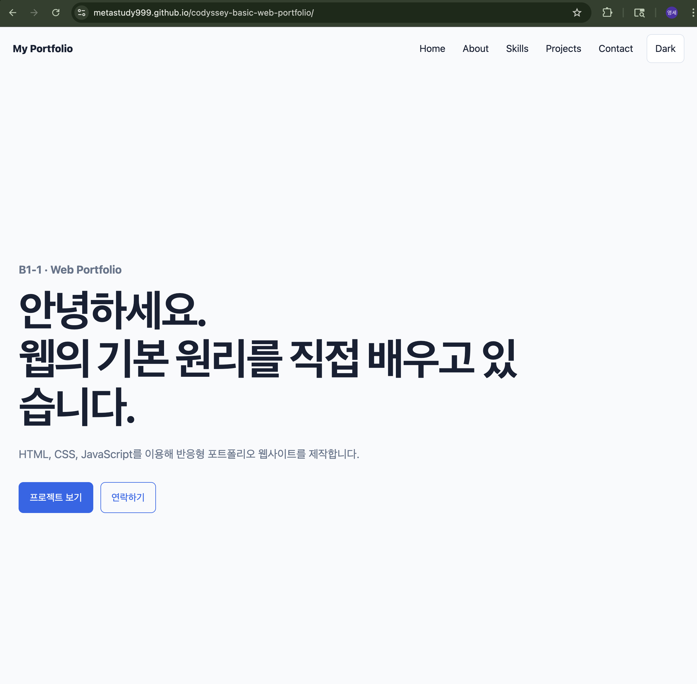
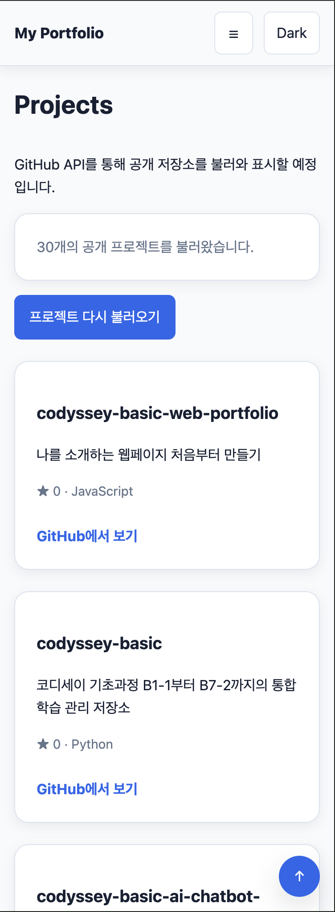
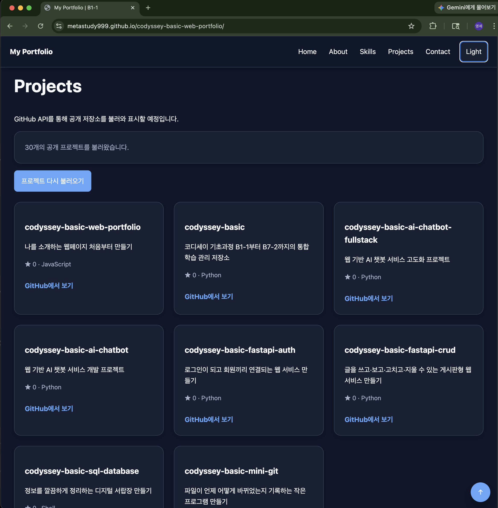

# CODYSSEY B1-1 — 나를 소개하는 웹페이지 처음부터 만들기

코디세이 AI 올인원 제2기 본과정의 **B1-1 웹 기초와 프론트엔드 필수 미션** 프로젝트입니다.

현재 Repository에 남아 있는 `B4-1`, `round-01-clear` 자료는 같은 주제의 과거 참고자료이며, 현재 수행 기준은 **제2기 B1-1 Mission PDF**입니다.

---

## 1. Mission

- Mission ID: **B1-1**
- 제목: **나를 소개하는 웹페이지 처음부터 만들기**
- 분야: **AI/SW 기초 — 웹 기초와 프론트엔드**
- 구현 방식: **HTML + CSS + Vanilla JavaScript**
- 현재 작업 Round: **`training/round-02-clear/`**
- Round 02 작업 브랜치: **`round-02/b1-1-web-portfolio`**
- 현재 배포 브랜치: **`main`**
- GitHub Pages Source: **`main:/`**

---

## 2. 구현 기능

### HTML

- Semantic HTML
  - `header`
  - `nav`
  - `main`
  - `section`
  - `article`
  - `footer`
- Hero
- About
- Skills
- Projects
- Contact
- 이미지 `alt`
- `label`과 입력 필드 연결
- 외부 CSS / JavaScript 분리
- JavaScript `defer`

### CSS

- CSS Custom Properties
- Mobile First 반응형 설계
- Flexbox
- CSS Grid
- `768px`, `1024px` Breakpoint
- Light / Dark Theme
- 프로젝트 카드 반응형 Grid
- Scroll Reveal Animation
- 모바일 Navigation

### JavaScript

- `const` / `let`
- `querySelector`
- `addEventListener`
- Arrow Function
- Destructuring
- `map()`
- `filter()`
- `forEach()`
- `fetch()`
- `async / await`
- `try / catch`
- `localStorage`
- `IntersectionObserver`

---

## 3. 주요 기능

### 3.1 Responsive Navigation

- 모바일 Hamburger Menu
- 메뉴 열기 / 닫기
- Navigation 클릭 시 Smooth Scroll
- 메뉴 선택 후 자동 닫힘

### 3.2 Dark Mode

Light / Dark Theme를 변경할 수 있습니다.

선택한 Theme는 `localStorage`에 저장되어 새로고침 후에도 유지됩니다.

```text
Click Event
→ State 변경
→ renderTheme()
→ DOM 변경
→ localStorage 저장
```

### 3.3 Scroll UI

현재 구현 기준값:

- Navigation Header 상태 변경: **60px 이상**
- Scroll Top 버튼 표시: **300px 이상**
- Scroll Top 클릭 시 페이지 상단으로 Smooth Scroll

### 3.4 Scroll Reveal

`IntersectionObserver`를 사용하여 Section이 화면에 진입할 때 한 번만 나타나는 애니메이션을 구현했습니다.

현재 Observer 기준값:

- `threshold`: **0.2**

### 3.5 Contact Form Validation

다음을 검증합니다.

- 이름 필수 입력
- 이메일 필수 입력
- 이메일 형식
- 메시지 필수 입력
- 필드별 오류 메시지
- 정상 입력 성공 메시지

현재 Contact Form은 **입력 검증 UI 범위**이며 실제 이메일 전송 기능은 포함하지 않습니다.

### Skills Roadmap

Skills 섹션은 제2기 공식 오리엔테이션/콘텐츠 소개 PDF를 기준으로 5단계 학습 역량을 정리합니다.

중복을 줄이기 위해 같은 기술이 여러 단계에서 반복되더라도 **처음 본격적으로 습득하는 단계**에 배치했습니다.

- 1. 입학 연수 — AI 도구 적응, 개발환경, Python 기초, Peer Review, 자기주도 학습, 문제 정의
- 2. AI 도구 학습 — 웹/React, Python 협업, Linux/OS, 자료구조·알고리즘, SQL/FastAPI, API, Cloud/AI 서비스
- 3. AI 심화 학습 — 데이터 분석, AI 수학, CV, NLP, ML/XAI, 딥러닝, 멀티모달
- 4. AI 응용 학습 — 산업 도메인 문제 구조화, KPI, End-to-End 아키텍처, MVP, 사업화 가설
- 5. 파이널 프로젝트 — 제품 완성, 시장·고객 검증, 비즈니스 모델, 운영성, 발표·Demo Day·IR

### Development Environment & Tech Stack

Skills와 별도로 **개발환경(Development Environment)** 을 역할별로 정리합니다.

공식 제2기 오리엔테이션·콘텐츠 소개·각 Mission PDF에서 확인되는 항목을 중심으로 작성하며, 미션·도메인에 따라 선택 도구는 달라질 수 있습니다.

- OS/실행환경 — Linux, 격리/재현 가능한 Local Env, Docker, Cloud VM/EC2, Chrome
- 개발언어 — HTML, CSS, JavaScript, TypeScript(선택), Python 3.10+, SQL
- 개발툴/Harness — Git, GitHub, VS Code, Live Server, Terminal/CLI, Cursor Composer, Claude Code, Codex, Open Code CLI, Jupyter
- Framework/Library — React 18+, FastAPI, Uvicorn, SQLAlchemy, Jinja2, python-multipart, passlib/bcrypt, LangGraph, Fairlearn, MONAI
- AI Model/Technique — Claude Opus/Sonnet, GPT-4/GPT-5o, Gemini Pro, Vision/Embedding, CNN/ViT, Transformer, LSTM, RAG, XAI/SHAP
- Infra/Service — GitHub Pages, AWS EC2, Supabase, Firebase, Vercel, Render/Railway, MLflow, n8n, Sentry, Pinecone, GPU Cluster
- Domain Platform — ROS, Autoware Universe, AWSIM, Gazebo, Isaac Sim, MuJoCo, MIMIC-III, DICOM, Alpaca, Stripe, Domain API/SDK

### 2026 Modern Extension & Security Baseline

공식 Mission PDF 요구와 최신 확장 기술을 **구분해서** 관리합니다.

#### 공식 PDF 기반

- B1-1: Vanilla HTML/CSS/JavaScript, Chrome, VS Code + Live Server, GitHub Pages/API
- B1-2: React 18+, Supabase/Firebase, JavaScript/TypeScript(선택), Vercel/Netlify
- B2: Python 3.10+, Git/GitHub, 표준 라이브러리·협업
- B3: AWS/VPC/EC2/IAM/Security Group, Python AI API CLI, 환경변수 Secret
- B4: Ubuntu/Linux, Bash, SSH/UFW·firewalld, ACL, cron, Docker/격리환경
- B5: Python 기반 Mini Redis/Mini Git, 자료구조·알고리즘 직접 구현
- B6: SQLite/MySQL/PostgreSQL/H2, FastAPI/Uvicorn/SQLAlchemy/Jinja2, 인증 패키지
- B7: FastAPI 기반 AI 챗봇, SQLite 권장, React+REST 풀스택, AI API, Cloud 배포

#### 실습 개발환경

- iMac/macOS → OrbStack → Ubuntu
- Windows 11 Pro → WSL2 → Ubuntu
- Backend → Python 3.10+ / FastAPI / Uvicorn / Pydantic / SQLAlchemy / Jinja2
- Database → SQLite / PostgreSQL / MySQL / H2 / Supabase PostgreSQL
- DB Client → DB Browser for SQLite / DBeaver / TablePlus / DataGrip / psql / sqlite3
- Database Security → 최소권한 계정, 외부 포트 최소화, 파라미터 바인딩, 백업/복구

```text
iMac / Windows 11 Pro
→ OrbStack / WSL2
→ Ubuntu
→ FastAPI
→ SQLAlchemy
→ SQLite / PostgreSQL
```

#### 2026 선택 확장

- Local AI: Ollama, Llama, Qwen, DeepSeek, Gemma, Local Embedding
- Agentic Development: Google Antigravity, Claude Code, Codex, Cursor Composer, MCP
- Automation: Make AI Agents, n8n, Webhook/API Workflow
- Container Orchestration: Docker → Kubernetes

#### Security Baseline

- OWASP Top 10:2025 관점의 접근제어·설정·공급망·암호·Injection·인증·로깅·예외처리
- OWASP LLM Top 10:2025 관점의 Prompt Injection·민감정보·공급망·Output Handling·Excessive Agency
- Secret Scanning / Dependency Review / CodeQL / SBOM / SLSA
- Kubernetes RBAC / Pod Security Standards / NetworkPolicy / Secret 관리 / Non-root
- NIST AI RMF Generative AI Profile 기반 AI Risk Management

상세 전수검토표:

`training/round-02-clear/docs/curriculum-tech-security-matrix.md`

### 3.6 GitHub API Projects

Projects는 코디세이 학습 단계별 카테고리로 구성합니다.

```text
전체 | 1. 입학 연수 | 2. AI 도구 학습 | 3. AI 심화 학습 | 4. AI 응용 학습 | 5. 파이널 프로젝트
```

현재 카테고리 정책:

- **전체**: 현재 공개된 과정 Repository 표시
- **1. 입학 연수**: `레포 준비중`
- **2. AI 도구 학습**: Repository 이름이 `codyssey-basic`으로 시작하는 공개 Repository만 표시
- **3. AI 심화 학습**: `예정`
- **4. AI 응용 학습**: `예정`
- **5. 파이널 프로젝트**: `예정`

현재 실제 Repository가 연결된 과정은 AI 도구 학습이므로, `전체`도 현재는 동일한 `codyssey-basic*` Repository 집합을 보여 줍니다.

GitHub REST API를 이용해 `MetaStudy999` 계정의 공개 Repository를 불러온 뒤 카테고리에 맞게 필터링합니다.

처리 상태:

```text
idle
→ loading
→ success
→ error
→ retry
→ success
```

Repository가 없는 경우를 위한 `empty` 상태도 처리합니다.

네트워크 오류 발생 시 오류 메시지와 다시 시도 기능을 제공합니다.

GitHub API 결과는 **페이지네이션(Pagination)** 으로 여러 페이지를 이동하며 볼 수 있습니다.

화면 폭에 따라 한 페이지의 카드 수를 행렬에 맞게 조정합니다.

- Mobile: **4개** — 1열 × 4행
- Tablet: **6개** — 2열 × 3행
- Desktop: **9개** — 3열 × 3행

예를 들어 공개 Repository가 30개이고 Desktop이라면 1페이지에 1–9번째 카드가 표시되고, `이전 / 1 / 2 / 3 / 4 / 다음` 버튼으로 이동합니다.

상태 문구 예:

`30개의 공개 프로젝트 중 1–9번째를 표시했습니다. (1/4 페이지)`

### Mission Number & Manual Progress

AI 도구 학습 Repository는 현재 제2기 Mission ID를 수동 매핑하여 표시합니다.

정렬 순서:

```text
B1-1 → B1-2 → B2-1 → B2-2 → ... → B7-2 → 공통
```

현재 미션:

```text
B1-1 · 진행
```

각 카드에는 Mission 번호와 진행 상태를 표시합니다.

```text
B1-1  진행
B1-2  준비
...
```

진행 상태는 자동으로 판단하지 않고 `js/script.js`의 `MISSION_PROGRESS`를 직접 수정합니다.

사용 가능한 값:

```text
준비 | 진행 | 완료
```

예:

```js
const MISSION_PROGRESS = {
  "B1-1": "진행",
  "B1-2": "준비",
  "B2-1": "준비",
};
```

현재 B1-1은 최종 CLEAR 전이므로 `진행`으로 두고, 이후 실제 완료 시 수동으로 `완료`로 변경합니다. 상태 자동화는 후속 고도화로 미룹니다.

### Project Card Typography & Links

Repository 이름과 설명 길이가 달라도 카드가 흔들리지 않도록 Typography 규칙을 고정했습니다.

- 카드 높이: 동일
- Repository 제목: 최대 2줄
- 설명: 최대 3줄
- 제목 줄간격: 1.35
- 설명 줄간격: 1.65
- 긴 Repository 이름은 자연스럽게 줄바꿈
- 링크 영역은 카드 하단에 고정

카드 하단 링크는 버튼이 아니라 **가운데 정렬된 텍스트 링크**로 표시합니다.

```text
깃허브 | 웹페이지
```

표시 규칙:

- GitHub URL과 Website URL이 모두 있으면: `깃허브 | 웹페이지`
- GitHub URL만 있으면: `깃허브`
- Website URL만 있으면: `웹페이지`
- 존재하지 않는 링크는 비활성 버튼으로 남기지 않고 아예 표시하지 않음
- 두 링크가 있을 때만 구분자 `|` 표시

링크 개수가 달라도 액션 영역은 카드 하단에서 **가로 가운데 정렬**합니다.

### Pagination UX

페이지 번호는 **화면에 고정(Fixed)** 하지 않고 Projects 섹션의 **전용 Pagination 영역**에 고정합니다.

페이지를 바꿔도 브라우저가 자동으로 위쪽으로 이동하지 않으며, 현재 스크롤 위치를 유지합니다.

또한 마지막 페이지처럼 실제 카드 수가 적어도 보이지 않는 Layout Placeholder로 남은 Grid Slot을 유지하므로, **Pagination의 세로 위치가 페이지마다 움직이지 않습니다.**

- Mobile: 항상 4 Slot
- Tablet: 항상 6 Slot
- Desktop: 항상 9 Slot
- 마지막 페이지의 빈 Slot은 화면에 보이지 않지만 Layout 공간은 유지
- 카드 높이도 일정하게 맞춰 Pagination 위치 안정화
- 페이지 클릭 시 자동 Scroll 없음

이 구조는 Pagination을 화면에 떠 있게 만드는 방식보다 사용자의 문맥과 레이아웃을 안정적으로 유지합니다.

인증 없는 GitHub API는 시간당 요청 제한이 있으므로, HTTP 403도 공통 error 상태로 처리합니다.

---

## 4. Event → State → Render

이 프로젝트에서는 사용자 Event와 외부 API 결과를 State에 반영한 후 Render 함수를 통해 DOM을 갱신합니다.

```text
Event
↓
State
↓
Render
↓
DOM
```

대표 흐름:

### Theme

```text
Theme Click
→ state.theme
→ renderTheme()
→ DOM
```

### Contact Form

```text
Input / Submit
→ state.form
→ validateForm()
→ renderFormErrors()
→ DOM
```

### GitHub API

```text
fetch()
→ state.projects
→ renderProjects()
→ DOM
```

---

## 5. 프로젝트 구조

```text
.
├── index.html
├── css/
│   └── style.css
├── js/
│   └── script.js
├── images/
│   ├── .gitkeep
│   └── profile-placeholder.svg
└── training/
    ├── round-01-clear/
    └── round-02-clear/
        ├── CHECKLIST.md
        ├── README.md
        ├── docs/
        ├── environment/
        └── evidence/
```

---

## 6. 개발 환경과 로컬 실행

### VS Code + Live Server

Repository에는 Live Server 권장 확장과 Workspace 설정을 포함합니다.

```text
.vscode/extensions.json
.vscode/settings.json
```

VS Code에서 Repository를 열고 `index.html`을 **Open with Live Server**로 실행할 수 있습니다. 기본 Live Server 포트는 `5500`으로 설정합니다.

### 독립 검증용 Python HTTP Server

Round 02 실제 Runtime 검증에서는 정적 서버를 독립적으로 확인하기 위해 Python HTTP Server도 사용했습니다.

```bash
cd "$HOME/projects/codyssey-basic-web-portfolio"
python3 -m http.server 8000
```

브라우저:

```text
http://localhost:8000
```

---

## 7. Round 02 실제 Runtime 검증

| 검증 항목 | 결과 |
|---|---|
| Local HTTP Server | PASS |
| 기본 페이지 렌더 | PASS |
| Dark Mode | PASS |
| Theme Persistence | PASS |
| Mobile Hamburger Menu | PASS |
| Smooth Scroll | PASS |
| Scroll Top | PASS |
| Contact Form Validation | PASS |
| GitHub API Loading | PASS |
| GitHub API Success | PASS |
| GitHub API Error | PASS |
| GitHub API Retry | PASS |
| GitHub API Empty | PASS |
| Responsive 375px | PASS |
| Responsive 768px | PASS |
| Responsive 1200px | PASS |
| IntersectionObserver | PASS |
| Secret Pattern Scan | PASS |
| GitHub CLI 설치 | PASS |
| GitHub CLI 인증 | PASS |
| Round 02 Branch Push | PASS |

---

## 8. Evidence

정적 검증 Evidence:

```text
training/round-02-clear/evidence/structure.txt
training/round-02-clear/evidence/verify.txt
```

수행 과정과 Runtime 검증 기록:

```text
training/round-02-clear/docs/implementation-log.md
training/round-02-clear/CHECKLIST.md
```

과거 Round 01 결과나 예상 출력을 Round 02의 실제 Evidence로 대신하지 않습니다.

---

## 9. GitHub CLI

GitHub 명령줄 인터페이스(GitHub Command Line Interface, `gh`)를 설치하고 GitHub 인증을 확인했습니다.

```bash
gh --version
gh auth status
```

인증 계정:

```text
MetaStudy999
```

Password, Token, Personal Access Token(PAT) 등의 Secret은 Repository와 Evidence에 기록하지 않습니다.

---

## 10. GitHub Pages

GitHub Pages에 실제 배포되었습니다.

```text
Deployment URL: https://metastudy999.github.io/codyssey-basic-web-portfolio/
```

실제 GitHub Pages URL에서 기본 화면, Dark Mode persistence, GitHub API, Mobile 375px, Contact/Scroll/Reveal Runtime을 재검증했습니다.

---

## 11. Screenshot Evidence

실제 GitHub Pages 배포 화면에서 다음 Screenshot Evidence를 확보했습니다.

### Desktop — Light Mode



### Mobile — 375px



### Desktop — Dark Mode



세 이미지는 실제 배포 페이지를 기준으로 촬영했으며,
Round 01 자료나 예상 이미지를 Round 02 Evidence로 사용하지 않았습니다.

---

## 12. Legacy Reference

Repository의 다음 자료는 같은 주제의 과거 참고자료입니다.

```text
b4-1-mission.pdf
b4-1-mission.md
b4-1-evaluation.md
training/round-01-clear/
```

현재 제2기 신규 수행은 다음 위치에서 관리합니다.

```text
training/round-02-clear/
```

---

## 13. CLEAR 원칙

다음 조건을 모두 만족해야 최종 CLEAR로 판정합니다.

```text
공식 요구사항
+ 실제 구현
+ 실제 Runtime
+ Verification PASS
+ 필요한 Evidence
+ GitHub Pages 실제 배포
+ 배포 사이트 재검증
+ 평가 설명 가능
+ Secret 노출 없음
```

## 평가 준비 바로가기

- [최종 요구사항/검증 상태](training/round-02-clear/docs/final-verification.md)
- [평가 설명 준비](training/round-02-clear/docs/evaluation-prep.md)
- [요구사항 연결표](training/round-02-clear/docs/requirements-mapping.md)
- [Round 02 Checklist](training/round-02-clear/CHECKLIST.md)

### 현재 상태

**Repository 구현·배포·Evidence·평가자료: READY**

남은 것은 사용자가 평가 전에 전체 흐름을 빠르게 훑고 자기 말로 설명하는 단계입니다. 사용자 구두 설명/모의평가 전에는 최종 `B1-1 CLEAR`로 표시하지 않습니다.
