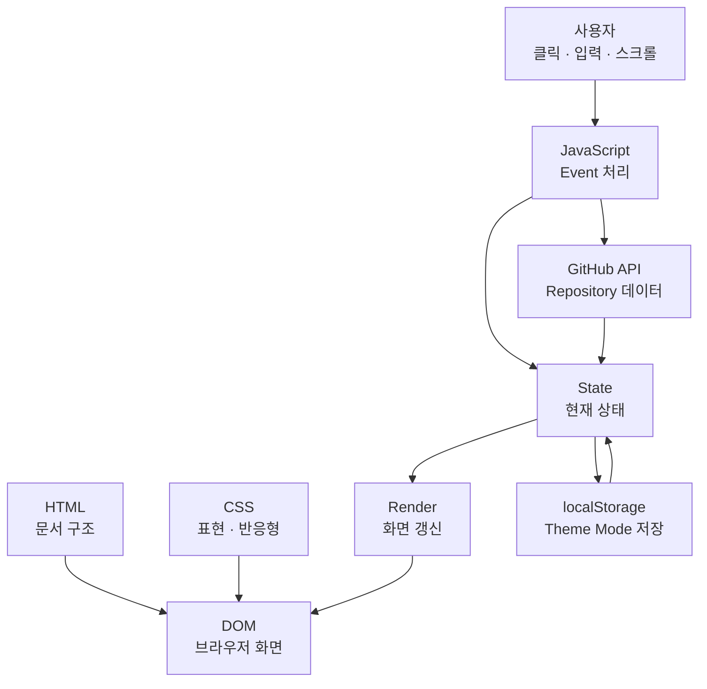
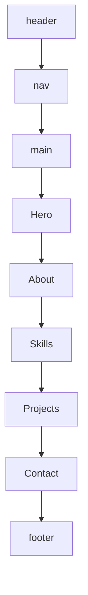
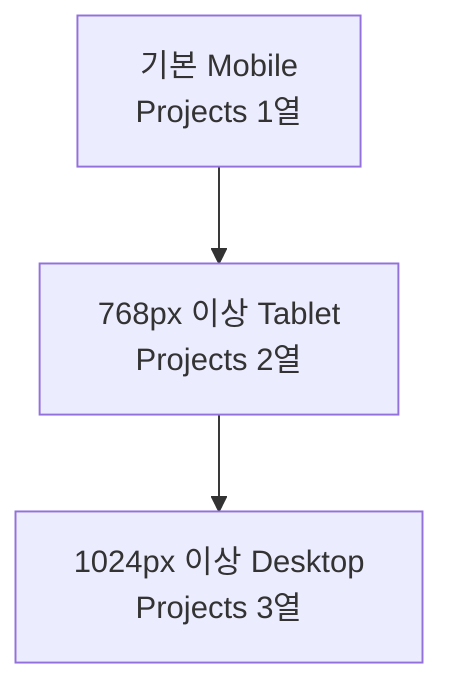
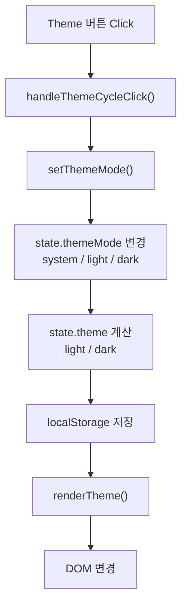
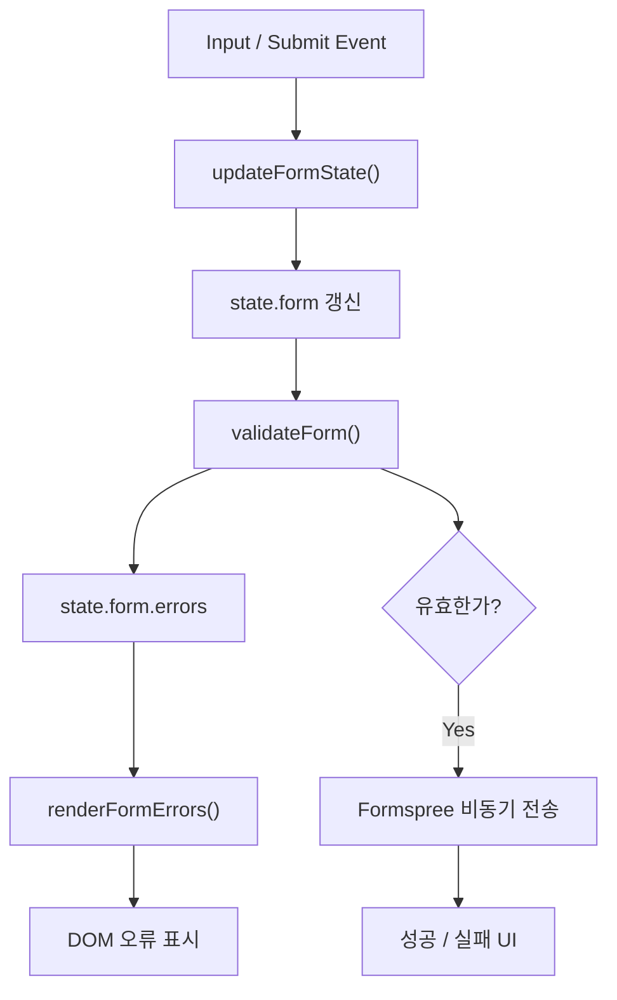
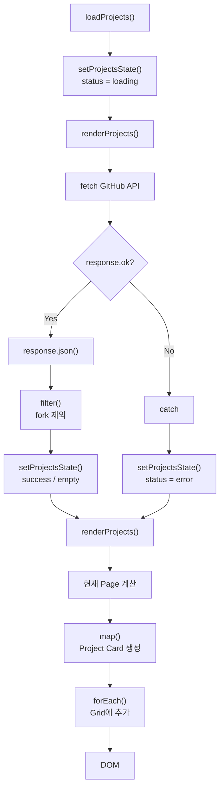

# B1-1 동료평가 1Page 따라하기

> **Mission:** B1-1 — 나를 소개하는 웹페이지 처음부터 만들기  
> **목표:** 코드를 암기하지 않고 **전체 구조 → 데이터 흐름 → 구현 이유 → 실제 시연 → 검증·증빙** 순서로 자기 말로 설명한다.  
> **기준:** 제2기 B1-1 Mission PDF + 기존 Evaluation + Round 02 실제 코드·Runtime·Evidence  
> **주의:** 예상 질문은 연습용이며 공식 평가문항이라고 표현하지 않는다.

---

## 0. 평가 시작 전 열어둘 것

- 서비스: https://metastudy999.github.io/codyssey-basic-web-portfolio/
- 코드: `index.html`, `css/style.css`, `js/script.js`
- 상세 평가 준비: `training/round-02-clear/docs/evaluation-prep.md`
- 최종 검증: `training/round-02-clear/docs/final-verification.md`
- 증빙: `training/round-02-clear/evidence/`

---

## 1. 20초 전체 설명

> B1-1은 외부 프레임워크 없이 HTML, CSS, JavaScript로 반응형 포트폴리오를 만든 미션입니다. HTML은 구조, CSS는 표현과 반응형 레이아웃, JavaScript는 이벤트·상태·렌더링을 담당합니다. 핵심은 **Event가 State를 바꾸고 Render가 DOM을 갱신하는 흐름**이며, GitHub API 비동기 처리와 GitHub Pages 배포까지 실제로 검증했습니다.

**기억법:** `구조 → 표현 → 동작 → 검증`

---

## 2. 전체 구조



**한 문장 핵심**

> **Event가 State를 바꾸고, Render가 DOM을 갱신한다.**

---

## 3. 파일 구조와 역할

| 파일/폴더 | 역할 | WHY |
|---|---|---|
| `index.html` | 문서 구조와 의미 | 화면 구조를 명확히 표현 |
| `css/style.css` | 색상·간격·레이아웃·반응형 | 표현을 HTML과 분리 |
| `js/script.js` | 이벤트·상태·렌더링·API | 동작 로직을 분리 |
| `images/` | 이미지 자산 | 정적 자산 분리 관리 |

> HTML은 구조, CSS는 표현, JavaScript는 동작으로 책임을 나누어 유지보수성을 높였습니다.

---

## 4. HTML 구조와 접근성



사용 요소:

- Semantic HTML: `header`, `nav`, `main`, `section`, `article`, `footer`
- 이미지 `alt`
- Form `label`
- Skip Link
- 오류 필드 `aria-invalid`
- 현재 Navigation `aria-current`
- 키보드 `:focus-visible`
- `prefers-reduced-motion`

**WHY**

> 태그와 접근성 속성이 콘텐츠의 의미와 현재 상태를 보조기술에도 전달하도록 했습니다.

---

## 5. CSS / 반응형 설계

### Mobile First



- Navigation → **플렉스박스(Flexible Box Layout, Flexbox)**  
  한 축(1차원) 정렬이 핵심이므로 사용
- Projects → **CSS 그리드 레이아웃(CSS Grid Layout, Grid)**  
  행과 열(2차원) 카드 배치가 필요하므로 사용
- CSS 변수(Custom Properties) → `:root`에서 색상·간격 등을 중앙 관리

**평가 답변**

> 작은 화면에서 필수 기능을 먼저 보장한 뒤 768px과 1024px에서 점진적으로 확장했습니다. 한 방향 정렬은 Flexbox, 행과 열을 함께 제어하는 반복 레이아웃은 Grid를 선택했습니다.

---

## 6. JavaScript 핵심 데이터 흐름

### 6-1. Theme — 실제 코드 순서



- `themeMode`: 사용자가 선택한 모드
- `theme`: 실제 화면에 적용되는 Light/Dark 상태

**VERIFY:** Theme 변경 → 새로고침 → 동일 모드 유지

---

### 6-2. Contact Form



**VERIFY:** 빈 값 → 잘못된 이메일 → 정상 입력 순서로 시연

---

### 6-3. GitHub API — 데이터 취득과 Render 분리



**WHY**

> 네트워크 요청은 실패하거나 결과가 비어 있을 수 있으므로 `loading / success / empty / error` 상태를 분리했습니다.

---

## 7. 코드 위치 Quick Map

| 설명할 기능 | 코드 위치 |
|---|---|
| 전체 상태 | `js/script.js → const state` |
| Theme | `handleThemeCycleClick()`, `setThemeMode()`, `renderTheme()` |
| Scroll UI | `renderScrollUi()` |
| Reveal | `IntersectionObserver`, `initializeReveal()` |
| GitHub API | `loadProjects()` |
| Projects 상태 | `setProjectsState()` |
| Projects 화면 | `renderProjects()` |
| Form 입력 | `updateFormState()` |
| Form 검증 | `validateForm()` |
| Form 오류 | `renderFormErrors()` |
| Navigation Flex | `css/style.css → .site-nav` |
| Projects Grid | `css/style.css → .projects-grid` |
| Tablet | `@media (min-width: 768px)` |
| Desktop | `@media (min-width: 1024px)` |

---

## 8. WHY 빠른 답변

| 질문 | 답변 |
|---|---|
| 왜 HTML/CSS/JS를 분리했나? | 구조·표현·동작의 책임을 분리해 유지보수하기 위해 |
| 왜 Semantic Tag를 썼나? | 문서 의미·접근성·유지보수성을 높이기 위해 |
| 왜 CSS Variable을 썼나? | 반복 값을 중앙 관리하고 Light/Dark Theme를 쉽게 바꾸기 위해 |
| 왜 `onclick` 대신 `addEventListener()`인가? | HTML과 동작 로직을 분리하고 여러 Listener를 연결하기 쉬워서 |
| 왜 `async/await`인가? | 요청→응답→JSON→상태 변경 흐름을 순차적으로 읽기 쉬워서 |
| 왜 `try/catch`인가? | 네트워크·403 등 예외를 Error State로 모아 처리하기 위해 |
| 왜 State 객체를 쓰나? | 현재 화면 상태를 한 구조에서 추적하고 Event→State→Render를 명확히 하기 위해 |
| 왜 Mobile First인가? | 작은 화면을 먼저 보장하고 큰 화면에서 점진 확장하기 위해 |
| 왜 Flexbox / Grid를 나눴나? | 1차원 정렬과 2차원 배치의 요구가 다르기 때문에 |

---

## 9. 실제 시연 순서 — 약 2분

1. GitHub Pages 열기
2. 화면 폭을 줄여 Hamburger 확인
3. Theme 변경 → 새로고침 → 유지 확인
4. Projects Reload → 카드와 상태 확인
5. Contact 빈 값 → 이메일 오류 → 정상 입력
6. Scroll → Header 60px / Scroll Top 300px / Reveal 확인
7. 필요 시 Error / Empty / Retry Evidence 제시

---

## 10. Verification → Evidence

| 검증 | 실제 근거 |
|---|---|
| 반응형 | 375 / 768 / 1200 Runtime |
| Dark Theme | `b1-1-final-desktop-dark.png` |
| Mobile | `b1-1-final-mobile-375.png` |
| Projects Filter | `b1-1-final-projects-filter.png` |
| System Theme | `b1-1-final-system-theme-sync.png` |
| 구조 | `evidence/structure.txt` |
| 정적 검증 | `evidence/verify.txt` |
| Formspree | `evidence/formspree-runtime-pass.txt` |
| 전체 결과 | `docs/final-verification.md` |

---

## 11. LIMITATION — 한계도 설명한다

- GitHub API는 **무인증 요청**이므로 Rate Limit 영향을 받을 수 있고, 403은 Error UI로 처리한다.
- `localStorage`는 현재 브라우저에 저장되므로 다른 브라우저·기기와 자동 동기화되지 않는다.
- JavaScript가 비활성화되면 HTML/CSS 기본 내용은 보이지만 Theme, API, Menu 등 동적 기능은 제한된다.
- Contact Form은 외부 서비스인 Formspree에 의존한다.

---

## 12. 마지막 20초 마무리

> B1-1은 HTML로 구조를 만들고 CSS로 반응형 화면을 구성하며 JavaScript로 Event → State → Render → DOM 흐름을 직접 구현한 프로젝트입니다. Navigation은 1차원 정렬이라 Flexbox, Projects는 2차원 카드 배치라 Grid를 사용했습니다. GitHub API는 loading·success·empty·error 상태로 나누어 처리했고, 실제 GitHub Pages에서 반응형·Theme·Form·API를 검증하고 Evidence까지 남겼습니다.

---

## 평가 연습 방법

```text
STEP 1 전체 20초 설명
→ STEP 2 구조 설명
→ STEP 3 Theme / Form / Projects 흐름
→ STEP 4 WHY 질문
→ STEP 5 실제 시연
→ STEP 6 Evidence
→ STEP 7 LIMITATION
→ 모의평가
```

각 질문은 **WHAT → WHY → HOW → VERIFY → LIMITATION** 순서로 답한다.
