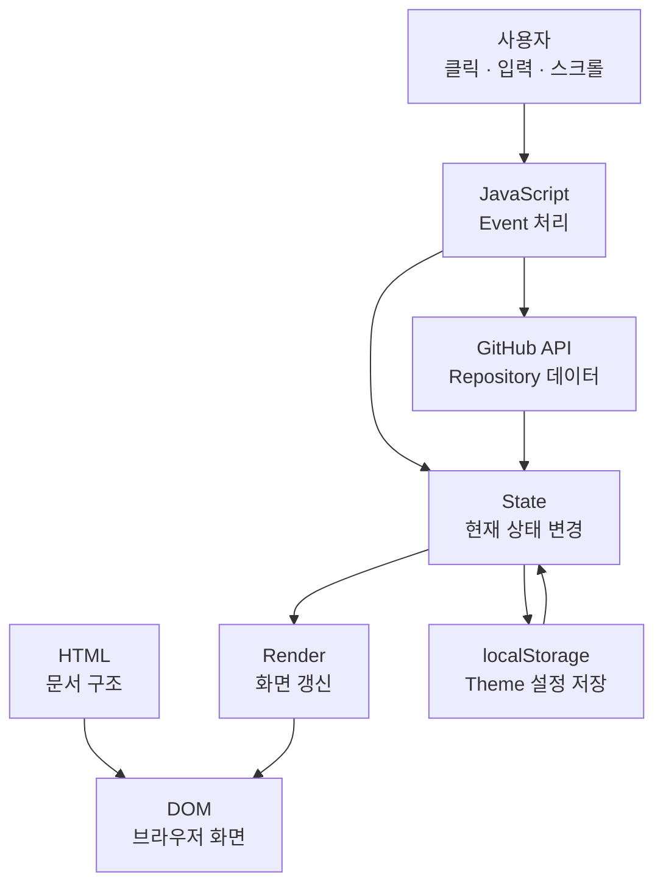

# B1-1 동료평가 1Page 따라하기

> **Mission:** B1-1 — 나를 소개하는 웹페이지 처음부터 만들기  
> **목표:** 코드를 암기하지 않고 **전체 구조 → 데이터 흐름 → 구현 이유 → 실제 시연** 순서로 자기 말로 설명한다.  
> **기준:** 제2기 B1-1 Mission PDF + 기존 Evaluation + Round 02 실제 구현/검증 결과  
> **주의:** 아래 예상 질문은 연습용이며 공식 평가문항이라고 표현하지 않는다.

---

## 1. 전체 설명 순서

```text
1. 미션 목적
2. 전체 파일 구조
3. HTML 구조
4. CSS / 반응형
5. JavaScript 데이터 흐름
6. 주요 기능 시연
7. GitHub API 비동기 처리
8. WHY 중심 마무리
```

## 2. 전체 구조와 데이터 흐름



**한 문장 핵심**

> **Event가 State를 바꾸고, Render가 DOM을 갱신한다.**

---

## 3. STEP 1 — 미션 목적

### 무엇을 만들었나?

순수 **HTML + CSS + Vanilla JavaScript**로 반응형 개인 포트폴리오 웹사이트를 만들었다.

### 무엇을 배우는가?

- HTML: 구조와 의미
- CSS: 표현과 반응형 레이아웃
- JavaScript: 사용자 이벤트, 상태, 화면 변화
- API: 외부 데이터 요청과 비동기 상태 처리

### 평가자에게 30초 설명

> 제가 수행한 미션은 B1-1, '나를 소개하는 웹페이지 처음부터 만들기'입니다. 외부 프레임워크 없이 HTML, CSS, JavaScript로 반응형 포트폴리오 웹사이트를 만들었습니다. HTML은 화면 구조, CSS는 디자인과 반응형 레이아웃, JavaScript는 사용자 이벤트와 상태 변화, 화면 업데이트를 담당합니다. 이 미션을 통해 사용자 Event가 State를 바꾸고 Render를 통해 DOM이 변경되는 웹의 기본 동작 원리를 직접 구현했습니다.

**기억법:** `구조 → 표현 → 동작`

---

## 4. STEP 2 — 파일 구조

```text
index.html
css/style.css
js/script.js
images/
```

- `index.html`: 문서 구조와 의미
- `css/style.css`: 색상, 간격, 레이아웃, 반응형
- `js/script.js`: 이벤트, 상태, 렌더링, API
- `images/`: 이미지 자산

**WHY**

> 구조·표현·동작의 책임을 분리하면 수정 범위를 예측하기 쉽고 유지보수가 쉬워진다.

---

## 5. STEP 3 — HTML 구조

```text
header
└─ nav

main
├─ Hero
├─ About
├─ Skills
├─ Projects
└─ Contact

footer
```

- `header/nav/main/section/article/footer` 등 Semantic HTML 사용
- 이미지 `alt`
- 입력 필드와 `label` 연결
- Skip Link 적용

**WHY**

> 태그 자체가 콘텐츠의 역할을 설명하게 하여 문서 구조, 접근성, 유지보수성을 높인다.

---

## 6. STEP 4 — CSS / 반응형

### Mobile First

```text
기본        Mobile  1열
768px 이상  Tablet  2열
1024px 이상 Desktop 3열
```

### Flexbox와 Grid 선택 이유

- **Navigation → Flexbox**: 로고와 메뉴를 한 축(1차원)으로 정렬
- **Projects → Grid**: 여러 카드를 행과 열(2차원)로 배치

**10초 답변**

> 한 방향 정렬은 Flexbox, 행과 열을 함께 제어하는 반복 레이아웃은 Grid를 사용했습니다.

---

## 7. STEP 5 — JavaScript 데이터 흐름

### Theme

```text
Theme Click
→ state.theme
→ renderTheme()
→ DOM
→ localStorage
```

### Contact Form

```text
Input / Submit
→ state.form
→ validateForm()
→ state.form.errors
→ renderFormErrors()
→ DOM
```

### Projects

```text
Reload / Initialize
→ state.projects = loading
→ fetch()
→ JSON
→ filter()
→ map()
→ success / empty / error
→ renderProjects()
→ DOM
```

**State 객체를 쓰는 이유**

> Theme, Projects, Form처럼 여러 상태를 한 구조에서 관리하면 현재 화면이 왜 그렇게 보이는지 추적하기 쉽고 Event → State → Render 흐름이 명확해진다.

---

## 8. STEP 6 — 실제 시연 순서

1. GitHub Pages 접속
2. 화면 폭을 줄여 Mobile Hamburger 확인
3. Theme 변경 → 새로고침 → 유지 확인
4. Scroll → Header / Scroll Top / Reveal 확인
5. Contact 빈 값·잘못된 이메일 → 오류 확인
6. 정상 입력 → 성공 흐름 확인
7. Projects Reload → GitHub API 카드 확인
8. 필요하면 Error / Empty / Retry Evidence 제시

---

## 9. STEP 7 — GitHub API 설명

사용 기술:

- `fetch()`
- `async/await`
- `try/catch`
- `filter()`
- `map()`
- `forEach()`

상태:

```text
loading
↓
success
또는
empty
또는
error
↓
retry
```

**WHY**

> 네트워크 요청은 항상 성공한다고 가정할 수 없기 때문에 loading / success / empty / error 상태를 분리했습니다.

---

## 10. STEP 8 — WHY 중심 마무리

> 이 미션에서 중요한 것은 기능 개수가 아니라, 왜 HTML·CSS·JavaScript를 분리했는지, 왜 Flexbox와 Grid를 다르게 선택했는지, 왜 State를 관리하는지, 비동기 요청이 성공하거나 실패할 때 화면이 어떻게 달라지는지를 제 코드와 실제 실행 결과로 설명할 수 있다는 점입니다.

---

## 평가자가 자주 물을 수 있는 질문

### Q. React를 왜 사용하지 않았나요?

> 이번 미션은 React 이전에 DOM, Event, State, Render의 기본 원리를 직접 이해하는 것이 목적이기 때문입니다. 이후 React가 이 과정을 어떻게 추상화하는지 이해하기 위한 기초입니다.

### Q. Flexbox와 Grid는 어떻게 구분했나요?

> Navigation처럼 한 축 중심이면 Flexbox, Projects 카드처럼 행과 열의 2차원 배치가 필요하면 Grid를 사용했습니다.

### Q. API가 실패하면 어떻게 되나요?

> `response.ok`와 `try/catch`로 실패를 감지하고 `state.projects`를 error 상태로 바꿔 오류 메시지와 다시 시도 UI를 렌더링합니다.

### Q. localStorage가 왜 필요한가요?

> 사용자가 선택한 Theme Mode를 브라우저에 저장하여 새로고침 후에도 같은 설정을 유지하기 위해 사용했습니다.

---

## 마지막 20초 요약

> B1-1은 HTML로 구조를 만들고, CSS로 반응형 화면을 만들고, JavaScript로 이벤트와 상태를 관리한 프로젝트입니다. 사용자의 Event가 State를 변경하고 Render 함수를 통해 DOM이 바뀌도록 설계했습니다. GitHub API도 loading·success·error·empty 상태로 나누어 처리했습니다. Navigation에는 1차원 정렬에 적합한 Flexbox, Projects에는 2차원 배치에 적합한 Grid를 사용했고, 실제 GitHub Pages에서 주요 기능을 검증했습니다.

## 따라하기 연습 방법

한 번에 전부 외우지 않는다.

```text
STEP 1 미션 목적
→ 자기 말로 설명
→ 확인

STEP 2 파일 구조
→ 자기 말로 설명
→ 확인

...

STEP 8 WHY 마무리
→ 실제 시연
→ 모의평가
```

각 단계는 **WHAT → WHY → HOW → VERIFY → LIMITATION** 순서로 설명한다.
