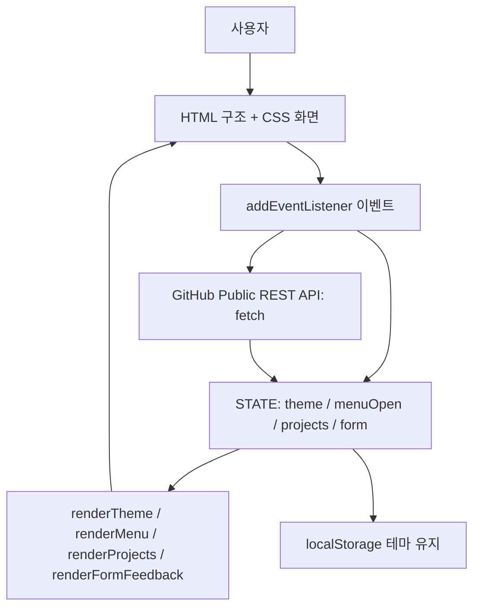

# B1-1 Round 03 실제 구조와 설계 근거

아래 내용은 `04-src/`의 실제 HTML/CSS/JS를 읽어 Round 03용으로 새로 해석했다.

## 실제 주요 기능
- `setTheme(theme)` → `STATE.theme` 저장 → `localStorage` → `renderTheme()`.
- `menuToggle` 클릭 → `STATE.menuOpen` 반전 → `renderMenu()`.
- `loadProjects()` → loading → GitHub API `fetch` → success/empty/error → `renderProjects()`.
- 폼 submit → `validateForm()` → `STATE.form` → `renderFormFeedback()`. **실제 이메일 전송은 구현하지 않은 학습 버전**이다.
- `IntersectionObserver`는 화면 진입 시 `.reveal` 요소를 표시한다.

## 아키텍처 결정
- Vanilla JS(순수 자바스크립트): 외부 프레임워크 없이 웹 기초를 직접 관찰
- Mobile First(모바일 우선): 작은 화면부터 스타일을 구성
- Flexbox / Grid 분리: 메뉴는 행 배치, 카드 영역은 격자 배치
- 명시적 `STATE`: 화면 변경의 원인을 추적
- Public GitHub API: 인증 비밀키가 필요 없는 연동, 단 요청 제한/네트워크 실패 처리 필요

## 경계
APOS 검증기는 다른 저장소에 있고, 본 저장소 `04-src/`는 미션 실행 소스다. 과거 Round 01/02 소스를 실행할 필요가 없다.
