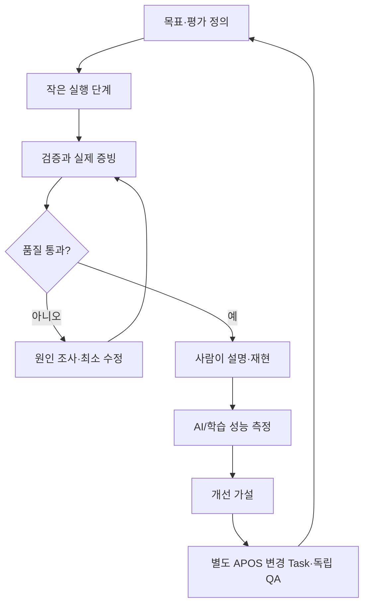

# 미션 수행 방식의 점진적 개선

한 번 잘 동작한 방법을 '최상'으로 고정하지 않는다. 반례와 새로운 분야에서 재검증한다.

## 범용 도메인 예
- 개발: 테스트·코드 품질·배포
- 연구: 근거·재현성·반증 가능성
- 학습/자격증: 설명·문제 해결·회상·전이
- 데이터 분석: 출처·정합성·통계적 타당성
- 창업: 문제 검증·고객 증거·가설 실험
- 금융/투자 **연구**: 데이터 시점·위험·시나리오·비용; 실거래는 별도 승인·통제
- 건강/IoT: 개인정보·안전·전문가 판단·물리적 위험 경계

## 승격 조건
B1-1에서 개선 가설을 제안 → 성능 측정 → 분야가 다른 두 번째 Mission에 적용 → 실패/성공 조건 분석 → APOS 중앙에 별도 Task/QA로 정식 반영.

학습 기록이나 이 문서 자체는 실행 권한이 없고 자동 자기수정을 허용하지 않는다.
